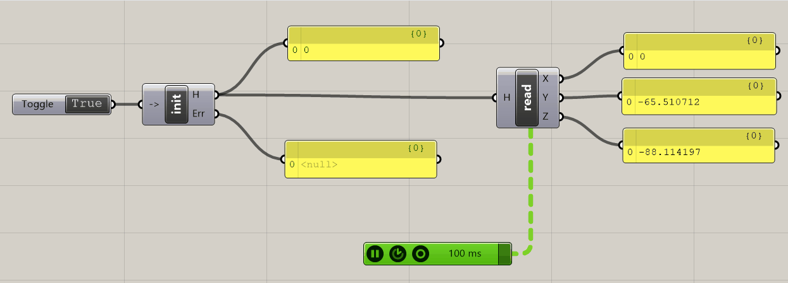

# grasshopperToOpenHaptics

Open `ghoh.sln` in Visual Studio 2022. It needs the [Project templates for Rhino 3D](https://marketplace.visualstudio.com/items?itemName=McNeel.Rhino7Templates2022) extension and Microsoft.NETCore 7.0.11.

Minimal viable example for position fetching from an open haptics device:

Tested with Grashopper Build 1.0.0007 (2023-12-12) in Rhino 8.2 and [Open Haptics v3.5](https://support.3dsystems.com/s/article/OpenHaptics-for-Windows-Developer-Edition-v35) on Windows 11
